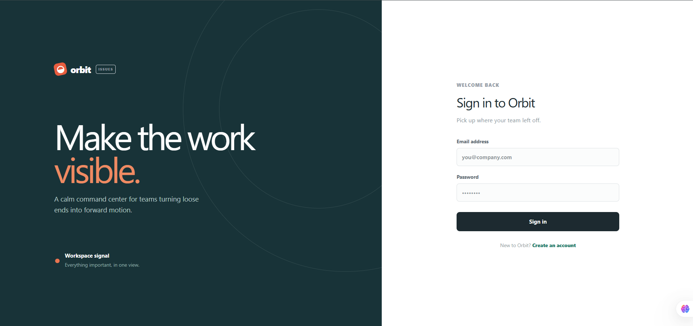

# Multi-Tenant-Issue-Tracker-API
Build a backend API where multiple organizations manage their own projects and tasks. Users belong to workspaces. Each workspace owns projects, and each project contains tasks.

## Local development

The API connects to MongoDB at `MONGODB_URI` during server startup. Start the local database with `docker compose up -d`, then run `npm run dev`. The health endpoint reports `database: "connected"` when MongoDB is active and `database: "in_memory"` when the development fallback is being used.

All workspace, project, and task queries are scoped to the authenticated workspace owner. Registration creates an initial owned workspace and returns it with the session token.

Run the approved HTTP scenarios with `npm run api:smoke`.
